<!-- If someone is going to read this for some reason... -->
<!-- I hope this is readable -->

# Отчёт

## Linux A (Server)

1. Сконфигурируем hostname как ```zaikovserver```

2. Создадим пользователя ```zaikov_1```

    

3. Сконфигурируем виртуальный интерфейс с ip ```192.168.19.10/24```, указав нужные параметры в .yaml конфиге по пути ```/etc/netplan/``` и применив новые параметры с помощью netplan apply. Предварительно был добавлен интерфейс ```enp0s8```.
    
    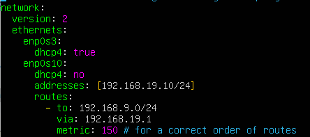
    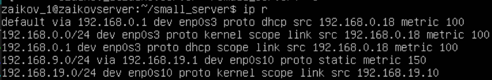
    Укажем ```metric``` для корректного дефолтного порядка маршрутизации (наверное, есть более правильный способ)

4. Развернём http сервер на машине на порту 5000 с тремя эндпоинтами:
    
    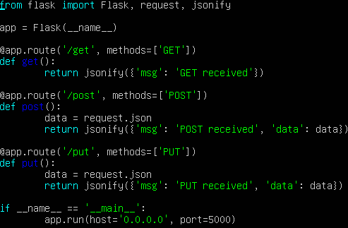
    
    Для тестов сделаем ещё более упрощённый вариант:
    
    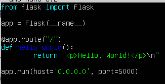

    Запустим:
    
    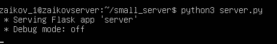

    Также для удобства добавим сервер в демон автозагрузки, оформив файл сервиса:
    
    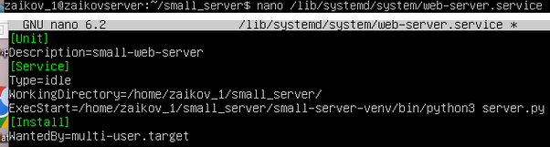
    
    После перезагрузки проверим статус сервера:

    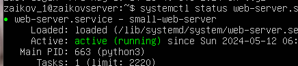


## Linux B (Gateway)

1. Сконфигурируем hostname как ```zaikovgateway```

2. Создадим пользователя ```zaikov_2```
    
    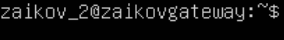

3. Сконфигурируем два виртуальных интерфейса с ip ```192.168.19.1/24``` и ```192.168.9.10/24```.

    С помощью редактирования ```/etc/netplan/00-installer-config.yaml``` сконфигурируем два дополнительных виртуальных интерфейса ```enp0s8``` и ```enp0s9```:

    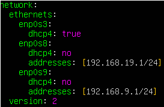

    и примением изменения с помощью
    ```netplan apply``` (под рутом)

4. С помощью утилит ```ip route``` и ```iptables``` настроим маршрут пакетов от <em>Linux A</em> до <em>Linux C</em>. Запретим все пакеты, кроме http пакетов через порт ```5000```
    С помощью команд
    ```
    iptables -A FORWARD -i enp0s9 -o enp0s8 -p tcp --syn --dport 5000 -m conntrack --ctstate NEW -j ACCEPT

    iptables -A FORWARD -i enp0s9 -o enp0s8 -m conntrack --ctstate ESTABLISHED,RELATED -j ACCEPT

    iptables -A FORWARD -i enp0s9 -o enp0s8 -m conntrack --ctstate ESTABLISHED,RELATED -j ACCEPT

    iptables -P FORWARD DROP
    ```

    добавим правило принятия <em>FORWARD</em> (проброса) пакетов с одного интерфейса на другой (с ```enp0s9``` на ```enp0s8``` и наоборот, но рукопожатие - с клиента на сервер).
    Также необходимо разрешить сам проброс пакетов с помощью команды:
    ```echo 1 | sudo tee /proc/sys/net/ipv4/ip_forward 1```
    и добавим в автозагрузку:
    ```nano /etc/sysctl.conf```
    с помощью строки
    ```net.ipv4.ip_forward = 1```

    Проверим, что фаервол был настроен правильно. Изменим на сервере порт на ```5001```:

    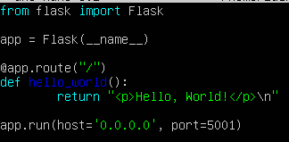

    Запустим его и попробуем пробросить с клиента пакеты на ```5001```:

    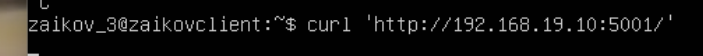

    Пакеты не прошли, теперь и в фаерволе изменим порт на ```5001```:

    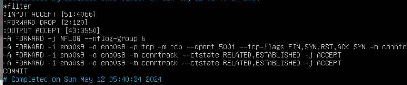

    Пробросим пакеты:

    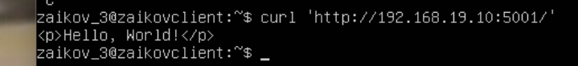

    Как видно, фаервол настроен корректно и не позволяет <em>tcp</em> пакетам инициализации с клиента проходить на другие порты кроме разрешенного. Вернём ```5000```-й порт.

5. Запустим программу tcpdump, предварительно добавив правило фильтрации с помощью команды:
    
    ```
    sudo iptables -t filter -I FORWARD -j NFLOG --nflog-group 6 (будем видеть все FWD пакетики)
    ```
    
    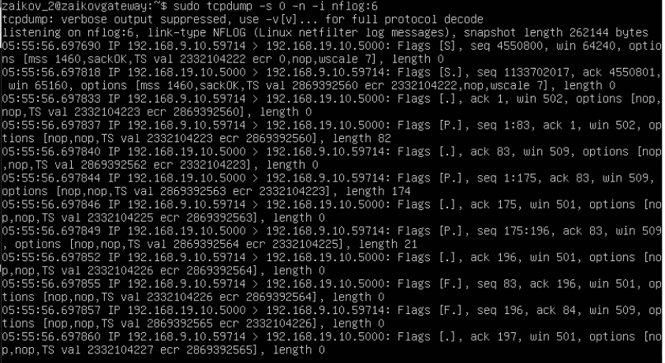
    Пакеты летят (флаги синхронизации в начале <em>S</em>, флаги пушинга данных <em>P</em>, флаги завершения в конце <em>F</em>)
    
## Linux C (Client)

1. Сконфигурируем hostname как ```zaikovclient```
2. Создадим пользователя ```zaikov_3```

    

3. Сконфигурируем виртуальный интерфейс с ip ```192.168.9.100/24```

    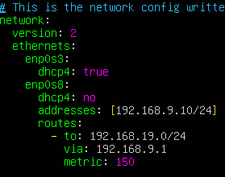

    и применим

    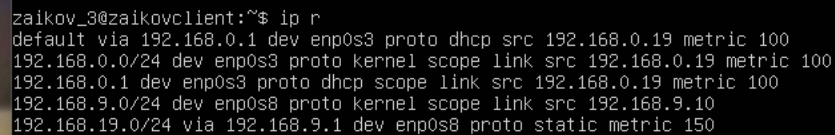

4. С помощью команды curl на машине <em>C</em> пошлём 3 запроса на машину <em>А</em> в <em>http</em> сервер (```/get```, ```/post```, ```/put```):

    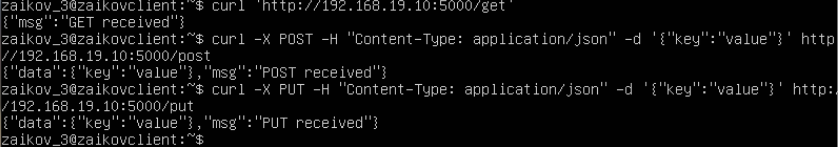

    На каждый запрос был получен ответ от сервера без ошибок